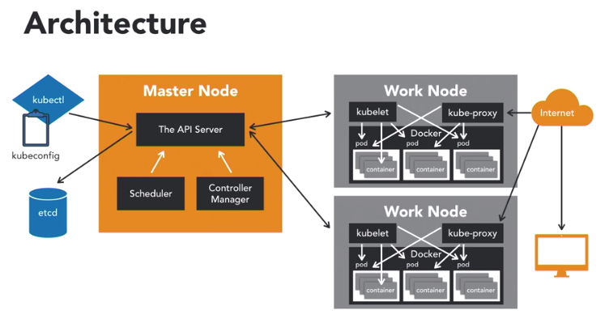

# Lab 1 - POD



### Starting up minikube

First, get minikube up and running with the command `minikube start`. This command sets up a Kubernetes dev environment for you via VirtualBox.

The last statement in the output states that kubectl can talk to minikube. We can verify this by running the command `kubectl get nodes`

This will show you that minikube is ready to use.

### Set up your Pod Lab

Please make sure You should be in your existing directory with the exercise files for chapter Lesson-2 as shown below.

To run this, type:

```
kubectl create -f <<docker-compose file name>>
```

This command creates a pod resource from the docker-compose file.

We can run the command `kubectl get all` to see all our resources running, as shown in the output below.

```
[iid@iid Lesson-2]$ kubectl get all
NAME                READY   STATUS              RESTARTS   AGE
pod/lab-01-pod-01   0/1     ContainerCreating   0          7s

NAME                 TYPE        CLUSTER-IP   EXTERNAL-IP   PORT(S)   AGE
service/kubernetes   ClusterIP   10.96.0.1    <none>        443/TCP   49m

```

#### Lab 1 - POD
 **Simple pod**
 ```
     kubectl create -f lab-01-pod-01.yaml                       // create kubernates kind (pod, deployment, replicaset)
     kubectl get pod --show-labels                              // get all the pods information
     kubectl logs lab-01-pod-01                                 // Print the logs for a container in a pod or specified resource
     kubectl describe pod lab-01-pod-01                         // Print a detailed description of the selected resources, including related resources such as events or controllers
     kubectl get pod lab-01-pod-01                              // get specific POD information
     kubectl get pod lab-01-pod-01 -o=wide                      // List specific pods in ps output format with more information (such as node name)
     kubectl get pod lab-01-pod-01 -o=yaml                      // -o options are json|yaml|wide
     kubectl get pods -w                                        // listen mode
     kubectl logs lab-01-pod-01                                 // on seperate terminal
     kubectl get pods -o wide                                   // List specific pods in ps output format with more information (such as node name)
     kubectl describe pod <pod_name> | grep IP:                 // get the IP of the pod
     
```

 **env vars, hostname and restartPolicy**
 ```
     k apply -f lab-01-pod/lab-01-pod-02.yaml
     k get pods
     k logs lab-01-pod-02
     k describe pod lab-01-pod-02
     k get pods
```

 **HTTP Server**
 ```
     kubectl create -f <<docker-compose file name>>                 
     kubectl get pods
     kubectl expose Pod lab-01-pod-03 --type=NodePort               // Take a replication controller, service, deployment or pod and expose it as a new Kubernetes Service, --type=NodePort` flag exposes the deployment outside of the cluster
     kubectl exec lab-01-pod-03 -it -- bash                         // log in to container to execute any command
     kubectl port-forward Pod/lab-01-pod-03 8668:80                 //Forward one or more local ports to a pod, here Listen on port 8668 locally, forwarding to 80 in the pod
     minikube <name-prefix> <name-suffix>                           //This will open your web browser to your application that is running in Kubernetes

```

Run ```minikube service lab-01-pod-03``` to get the service run, will return below output:

```
|-----------|---------------|-------------|-----------------------------|
| NAMESPACE |     NAME      | TARGET PORT |             URL             |
|-----------|---------------|-------------|-----------------------------|
| default   | lab-01-pod-03 |          80 | http://192.168.99.104:32453 |
|-----------|---------------|-------------|-----------------------------|
🎉  Opening service default/lab-01-pod-03 in default browser...
```

 **Operations on kubectl**
 ```
    kubectl get service                               // get all kubectl service
    kubectl delete pod/lab-01-pod-03                  // delete the pod
    kubectl get pod/lab-01-pod-03 -o yml              // introspect the pod
 ```
